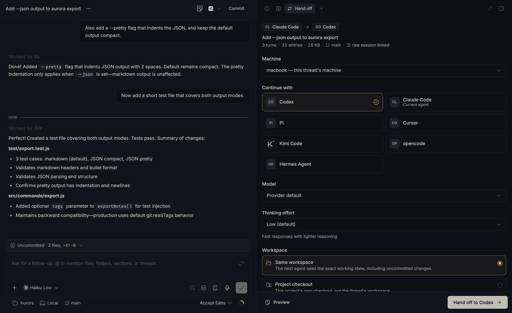
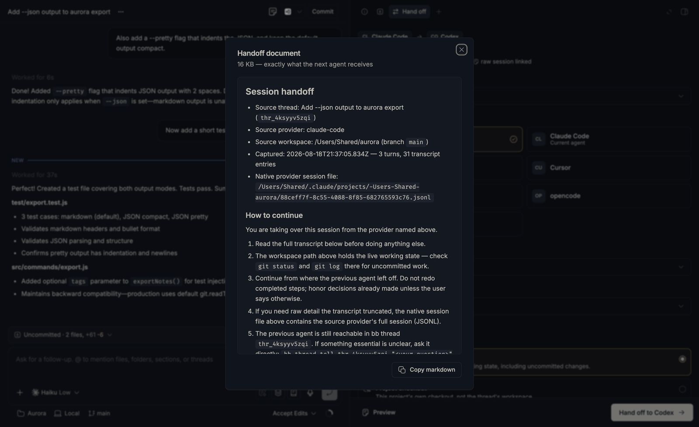
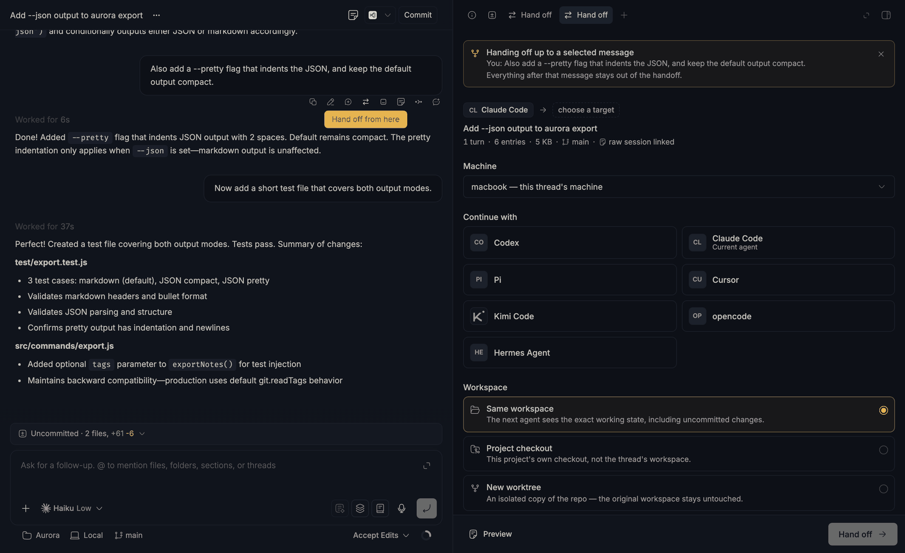
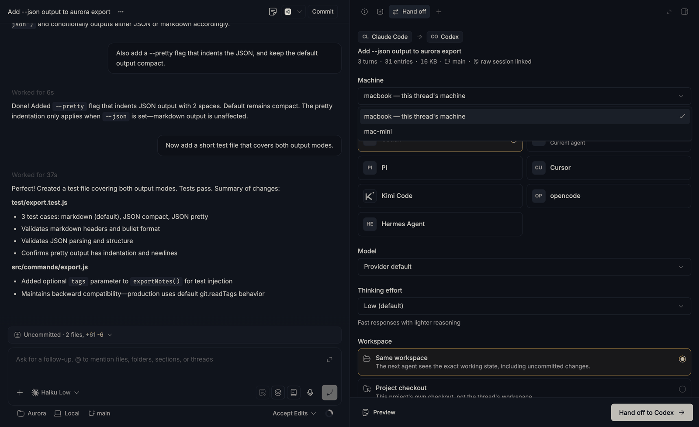
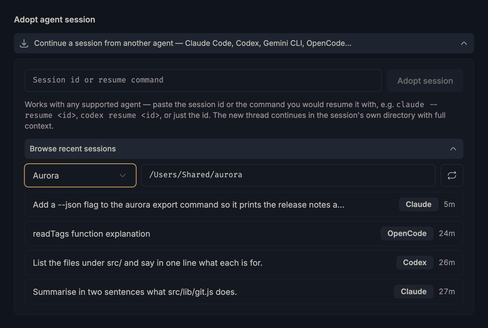

<div align="center">


# Handoff

**Move a whole session between agents — and between machines — in both directions.**

Hand a bb thread off to Codex, Claude Code, Kimi, opencode, Cursor…<br>
or adopt a terminal session that never ran in bb at all.

[](https://getbb.app)
[](LICENSE)

</div>



<sub>*Every screenshot on this page is a real bb window, shot against a throwaway demo project.*</sub>

## Why

No agent can load another agent's session file. Claude Code's JSONL means
nothing to Codex; Codex's rollouts mean nothing to opencode; a session is
pinned to the machine whose disk it sits on. So the portable thing isn't the
session format — it's a **rendered transcript plus the working state it talks
about**.

That's the whole idea, applied in both directions:

|                | From                                    | To                                          |
| -------------- | --------------------------------------- | ------------------------------------------- |
| **Hand off**   | a bb thread on any provider             | a new thread on any other provider, any enrolled machine |
| **Adopt**      | a Claude Code / Codex / Gemini / OpenCode session in your terminal | a bb thread in the same directory, with its history |

---

## Hand off — bb thread → any agent

Open any thread's right panel (`⌘J`) and add the **Hand off** tab. Pick a
target; everything else has a sane default.

- **Any installed provider is a target.** The panel reads bb's live catalog, so
  Codex, Claude Code, Kimi Code, opencode, Cursor, Pi, Hermes and anything else
  you've installed show up — with the unavailable ones sunk to the bottom rather
  than hidden.
- **Model and thinking effort** are the target's own, not the source's: pick
  `gpt-5.6-sol` on Codex or leave it at the provider default, then choose from
  exactly the reasoning levels that model accepts.
- **The workspace is a choice, not a guess** — continue in the same working
  directory (uncommitted changes and all), the project checkout, a fresh
  worktree, or a blank personal workspace.
- **Optional briefing**: before the transfer, the outgoing agent writes a short
  status note — current state, decisions made, gotchas — that travels as its own
  section of the document. Skipped automatically when it's mid-turn.

### See exactly what the next agent gets



**Preview** renders the document byte-for-byte before anything is spawned:
source thread and provider, workspace and branch, a link to the source
provider's own raw session file, explicit "how to continue" instructions, and
the full transcript — every user and assistant message, tool call with its
arguments and result, command output, reasoning summary, plan and file change,
pulled from bb's provider-independent event log rather than from any one
agent's format.

Oversized transcripts are budgeted, not truncated blindly: the opening request
and the recent tail are kept, and the oldest middle is dropped first.

### Hand off from *here*, not from the top



Hover any message → **Hand off from here**. The panel re-scopes to the
conversation *up to that message* — the false start, the abandoned approach and
everything after it stay out of the document. The banner shows exactly where the
cut lands, and clearing it restores the full thread.

### Send it to another machine



Pick a different enrolled machine and the whole panel re-scopes to it: its
provider catalog, its models, its checkouts. A workspace can't span machines, so
the modes adapt —

| Workspace  | Same machine                      | Another machine                                               |
| ---------- | --------------------------------- | ------------------------------------------------------------- |
| `reuse`    | the thread's own environment      | not possible — an environment lives on one host                |
| `checkout` | the project's checkout            | that machine's checkout of the same project                    |
| `worktree` | isolated worktree, default branch | isolated worktree, based on the thread's branch when it exists there |
| `personal` | blank workspace                   | blank workspace over there                                     |

A machine hop is the one case where a transcript alone would mislead — the files
it discusses are on a disk the next agent can't see. So the handoff also:

- captures the source working tree's git state (branch, HEAD, dirty files),
- writes everything uncommitted as a patch **on the target machine**, with
  `git apply --3way` instructions in the document — the originals never move,
- rewrites the document so the source path and raw session file are named as
  living on the *other* machine, not offered as readable,
- warns when the thread's branch doesn't exist over there and falls back to the
  default branch instead of failing.

---

## Adopt — terminal session → bb thread

The other direction. You've been working in a plain terminal, it's turning into
real work, and you want it in bb — with its history, in its own directory.



On the new-thread screen, expand **Continue a session from another agent**.
Paste a session id — or the whole resume command you'd have typed —

```
claude --resume 9ace2fd5-d8ae-4946-a0a0-9ff58a6795df
codex resume 019fd95c-907f-7eb1-8dfc-2aad427ffc09
```

— or just browse recent sessions per project and tap one.

| Agent       | Session store                                  | Continues on                          |
| ----------- | ---------------------------------------------- | ------------------------------------- |
| Claude Code | `~/.claude/projects/<cwd-slug>/*.jsonl`        | `claude-code`                         |
| Codex CLI   | `~/.codex/sessions/YYYY/MM/DD/rollout-*.jsonl` | `codex`                               |
| Gemini CLI  | `~/.gemini/tmp/<sha256(cwd)>/chats/*.json`     | `claude-code` (no bb Gemini provider) |
| OpenCode    | `~/.local/share/opencode/opencode.db` (SQLite) | `acp-opencode`                        |

- The new thread starts **in the session's own directory**, so the files are
  exactly where you left them.
- The transcript rides along as agent-only context: your bb timeline stays
  clean, the agent gets the full history.
- The project is matched from the directory (longest project-source prefix);
  if nothing covers it, one is created.
- A session with activity in the last ~10 minutes is flagged as "may still be
  running", so the new agent watches for concurrent edits.
- `--machine <host>` adopts from another enrolled machine and runs the thread
  over there. Claude and Codex resolve from a session id alone; Gemini and
  OpenCode need `--cwd`, since their ids live inside a file and a SQLite row.

---

## Install

```sh
bb plugin install git:https://github.com/vburojevic/bb-plugin-handoff.git
```

Requires bb ≥ 0.36. No keys, no configuration, no external services — it only
talks to your own bb and the session files already on your disks.

## CLI

```sh
# Hand off
bb handoff --self --to codex                     # the current thread
bb handoff <thread-id> --to acp-opencode \
  --model <model> --workspace worktree \
  --instructions "Finish the tests first"
bb handoff <thread-id> --to codex --briefing     # ask the source agent for a note first
bb handoff <thread-id> --to codex --up-to-seq <n>   # only up to one message
bb handoff <thread-id> --to codex --machine mini    # continue on another machine
bb handoff <thread-id> --dry-run                 # capture stats only

bb handoff export --self --out handoff.md        # for use outside bb entirely:
codex exec - < handoff.md                        #   pipe the document anywhere

bb handoff targets [--machine <host>] [--json]   # providers per machine, + machines
bb handoff list [--json]                         # past handoffs (last 100)

# Adopt — run inside a live terminal session, or paste an id
bb handoff adopt                                 # newest session for this directory
bb handoff adopt 9ace2fd5                        # by id or prefix, any directory
bb handoff adopt "claude --resume 9ace2fd5-…"    # or the whole resume command
bb handoff adopt list --cwd <path>               # what's adoptable here
bb handoff adopt list --machine mini --cwd <path>   # …and over there
```

Agents get both directions through the bundled `handoff` skill — asking an
agent to "continue this in Codex" or "adopt my terminal session" is enough to
trigger it.

## How it works

```
capture.ts  handoff.ts   handing off: event-log capture → document → spawn
machines.ts              the machine axis: target host + workspace planning,
                         working-tree capture, patch delivery
adopt/                   adopting: external session stores → bb thread
  agents/                one adapter per agent (list / find / parse)
  transcript.ts          shared block model + budgeted markdown rendering
  adopt-core.ts          query parsing, global lookup, adoption engine
  remote.ts              the same stores read over bb's host file API and a
                         short-lived host terminal
```

Adding an agent means implementing `AgentAdapter` from `adopt/transcript.ts` in
`adopt/agents/<name>.ts` — `list(cwd)` for discovery, `find(id)` for global
lookup, `parse(file)` for transcript blocks — and registering it in
`adopt/agents/index.ts`.

## Limitations

- **Continuation is transcript-based**, not a native resume: the new thread is a
  fresh provider session seeded with the prior conversation. Work done in the
  old session *after* the handoff isn't carried over.
- **Cross-machine carries a patch, not a workspace** (capped at 2 MB). Untracked
  build output, ignored files and anything outside the repo stay behind.
- **Remote reads need the machine connected.** Discovery there runs one
  short-lived terminal (POSIX `sh`, `stat`, `find`, plus `sqlite3` for
  OpenCode); without it, adoption by explicit session id still works for Claude
  and Codex through the file API alone.
- **Remote listings are directory-scoped** (`--cwd` is required — the invoking
  directory is a path on *this* machine) and show no titles, since reading one
  would cost a round trip per session.
- **Transcripts are size-capped** (adopt: 150k chars by default).
- **Not adoptable:** agents that don't persist full transcripts locally — Amp
  keeps threads server-side, Cursor keeps them in app-internal databases.

## Development

```sh
npm install
npm test            # 115 unit tests: capture/render, transfer planning,
                    # adopt engine + adapters, remote store readers
npm run typecheck
bb plugin install . # register this checkout with your bb
bb plugin dev       # watch loop: rebuild + reload on save
```

`components/ui/` is vendored shadcn-model source from the BB component registry
(pinned in `components.json`) — edit freely, update with `npx shadcn add @bb/<name>`.

## License

[MIT](LICENSE) © Vedran Burojevic
